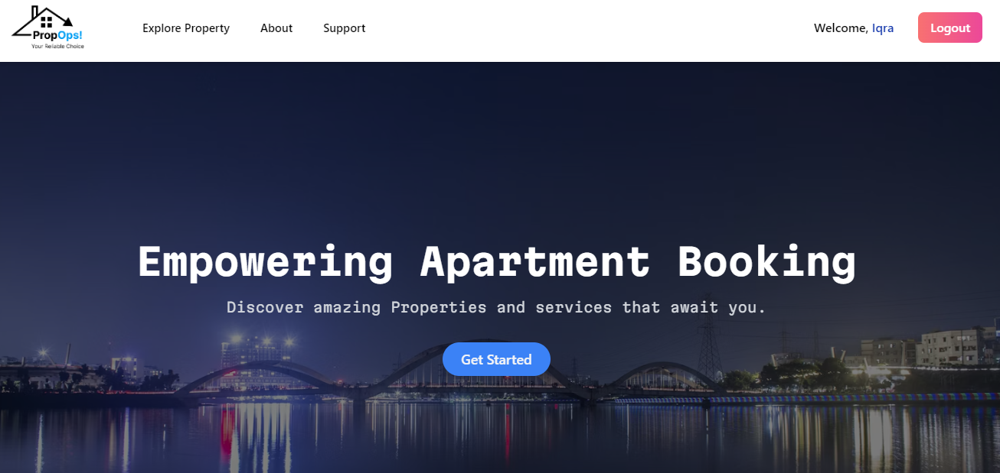

<h1>Prop-Ops - Your Premier Property Buy/Rent Platform 🏡</h1>

Welcome to Prop-Ops, your premier destination for buying or renting properties hassle-free! Whether you're looking for your dream home or a lucrative investment opportunity, Prop-Ops has got you covered. With a comprehensive set of features tailored for property transactions, Prop-Ops ensures a seamless experience for both buyers and renters.

<h2>Features 🏡</h2>
<ul>
    <li>Property Listings: Explore a diverse range of properties for sale or rent.</li>
    <li>Property Details: View comprehensive information about each property, including specifications, amenities, and location details.</li>
    <li>Property Alerts: Set up property alerts to receive notifications when new properties matching your criteria are listed.</li>
    <li>Booking Appartments: Schedule appointments to view properties in person/or book.</li>
    <li>User Profile:User can Update their Profile info & Profile Picture</li>
</ul>

<h2>Made With 💻</h2>

     
     
    
     

<h2>Installation ⚙️</h2>
<ol>
    <li>Clone the repository:</li>
</ol>

<pre><code>git clone https://github.com/yeakiniqra/Prop-Ops.git</code></pre>

<ol start="2">
    <li>Navigate to the project directory:</li>
</ol>

<pre><code>cd Prop-Ops</code></pre>

<ol start="3">
    <li>Install dependencies:</li>
</ol>

<pre><code>pip install -r requirements.txt</code></pre>
<pre><code>pip install Django</code></pre>

<ol start="4">
    <li>Apply migrations:</li>
</ol>

<pre><code>python manage.py migrate</code></pre>

<ol start="5">
    <li>Run the development server:</li>
</ol>

<pre><code>python manage.py runserver</code></pre>

<ol start="6">
    <li>Access the website at <code>http://localhost:8000</code> in your browser.</li>
</ol>

<h2>Screenshots 📸 </h2>

<h3>Homepage</h3>

<h3>Login</h3>

<h3>Sign Up</h3>

<h3>Property Explore</h3>

<h3>Property Details</h3>

<h3>User profile</h3>

<h3>Booking</h3>

<h2>Developed by</h2>
<ul>
    <li><strong>Nazmul Yeakin Iqra</strong>, CSE, UAP</li>
</ul>

